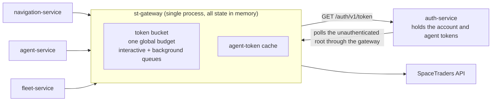
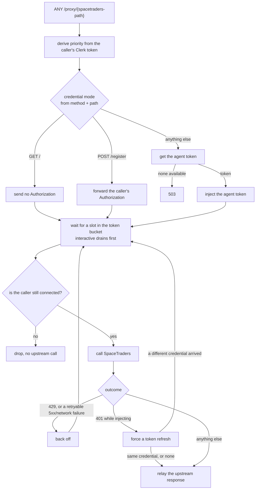
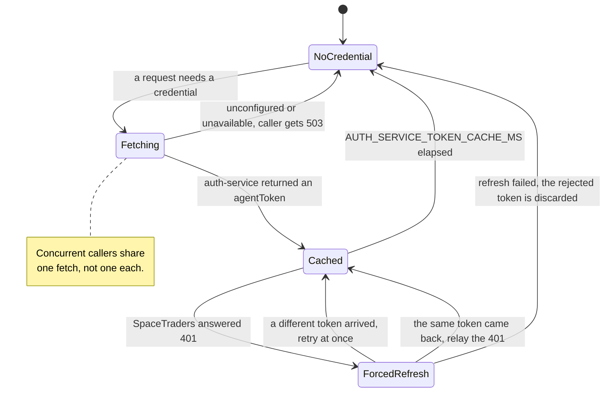

# st-gateway

**Every SpaceTraders call the whole system makes goes through this one process,
so the whole system spends one rate budget instead of several.** That is the
entire point. A second consequence follows from it: because every call passes
through here anyway, this is also the only place that needs to hold the
SpaceTraders agent token — callers no longer carry it.

Three things live here and nowhere else:

1. **One global rate budget.** A single token bucket paces every outbound call,
   FIFO, shared across all callers. Three independent clients tripping 429s
   against a per-account limit was the problem this service exists to solve
   ([meta#1](https://github.com/V-M-Pioneer-Trading/meta/issues/1)).
2. **The SpaceTraders credential.** The gateway fetches the agent token from
   auth-service, caches it, and injects it. A caller's own `Authorization` is
   ignored on game calls.
3. **Centralized retry.** 429s, 401s and — for side-effect-free methods only —
   5xx and network failures are retried here, once, centrally, instead of in
   four different client libraries with four different backoff bugs.

Everything else is a consequence of those three.

## Architecture

There is no database and no disk. The rate budget and the token cache are
process-local, which is why this service is single-instance by construction —
see [Known limitations](#known-limitations).

## What one proxied request does

### Credential policy

Matched on **method and path** — a query string does not change the decision.

| Method + path | What is sent upstream | Why |
|---|---|---|
| `GET /` | nothing | SpaceTraders' root needs no credential, and *not* injecting is what lets auth-service poll it through this gateway without the gateway having to ask auth-service for a token in order to make the call that refreshes that token. |
| `POST /register` | the caller's own `Authorization`, verbatim | Registration authenticates with the **account** token, which only auth-service holds. Injecting here would send the wrong token, and — since an UNCONFIGURED auth-service has no agent token at all — would 503 the one call that has to work in order to ever leave UNCONFIGURED. |
| everything else | `Bearer <agent token>`, injected | The gateway owns the credential. If it cannot get one, the call gets a 503 rather than a guaranteed-failing upstream attempt. |

### Retry policy

A 429 means SpaceTraders did **not** execute the request, so replaying it is
free. A 5xx or a dropped connection may mean it *did* execute, so a POST that
might already have bought something is never replayed.

| Upstream outcome | `GET` / `HEAD` / `OPTIONS` | Every other method |
|---|---|---|
| `429` | retry with backoff | retry with backoff |
| `401`, while injecting | force a refresh; retry at once **only if a different credential comes back** | same |
| `401`, on `GET /` or `POST /register` | relayed as-is | relayed as-is |
| `500` `502` `503` `504` | retry with backoff | relayed as-is |
| network failure | retry with backoff | `502` |
| anything else | relayed as-is | relayed as-is |

Backoff is `min(max(RETRY_BASE_MS × 2^attempt, Retry-After), MAX_RETRY_DELAY_MS)`.
A 401 retry is deliberately immediate: a stale credential needs a new token,
not a delay. Retries re-enter the rate-limiter queue like any other call, so
retrying never bypasses the budget.

### The agent-token cache

`NoCredential` covers both "never fetched" and "held but past its TTL": in
either case the next request that needs a credential refetches. The
`ForcedRefresh --> NoCredential` edge matters — before it existed, a refresh
that failed left the credential SpaceTraders had *just* rejected in the cache,
to be re-injected on every request until the TTL ran out.

### Priority

Priority is derived from a **verified** identity, never declared. The caller's
own `Authorization` (a Clerk token) is verified locally against an RS256 public
key; a genuine human session — `sub` starting `user_` — earns the interactive
lane. Everything else is background: no token, an expired or foreign-signed
one, or a Clerk M2M token, whose `sub` is a Machine ID (`mch_`). `X-Priority` is
not read at all, so no caller can promote itself.

Verification never rejects a request. It only chooses a queue.

> **Interim gap.** The calling services do not yet forward their own Clerk token
> here — until they do, every request fails verification and lands in
> background, including genuinely interactive dashboard traffic. This was
> accepted deliberately: shipping verification closed the spoofing hole
> immediately rather than leaving it open until the callers change.

## Endpoints

| Method + path | Returns | Auth |
|---|---|---|
| `GET /health` | `{ "status": "ok" }` | none |
| `GET /api/st-gateway/health` | same handler; the path the shared host routes to | none |
| `GET /metrics` | `{ queues: { interactive, background }: { depth, latencyMs: { count, avg, max } } }` | none |
| `ANY /proxy/<spacetraders-path>` | the upstream response, relayed | optional; a Clerk token only chooses the queue |

Method, query string and body are forwarded verbatim; the body is never parsed.
On the way back, the status, the body and the pacing headers (`Retry-After`,
`x-ratelimit-*`) are relayed.

## Errors the gateway generates itself

Everything not listed here is an upstream response passed through unchanged.

| Status | When | Message |
|---|---|---|
| `503` | auth-service answered, but has no agent token to give | `SpaceTraders credential not configured` |
| `503` | auth-service could not be reached, or spoke nonsense | `auth-service unavailable: cannot obtain a SpaceTraders credential` |
| `502` | SpaceTraders unreachable after retries | `SpaceTraders unreachable: …` |
| `502` | the upstream response failed mid-read, or the handler threw | `SpaceTraders proxy failed: …` |
| `413` | request body over 5 MB | from the body parser |

The two 503s are deliberately different: one points at the SpaceTraders
credential, the other at auth-service. They used to be the same sentence.

## Configuration

| Env var | Default | Meaning |
|---|---|---|
| `PORT` | `3002` | Listen port. Must be a whole number ≥ 1. |
| `SPACETRADERS_BASE_URL` | `https://api.spacetraders.io/v2` | Upstream base URL |
| `RATE_LIMIT_RPS` | `2` | Global budget, requests/second (≥ 0.1) |
| `RATE_LIMIT_BURST` | `1` | Bucket capacity: requests dispatchable back-to-back (≥ 1) |
| `MAX_RETRIES` | `5` | Retries after the initial attempt. Whole number ≥ 0. |
| `RETRY_BASE_MS` | `500` | First backoff delay; doubles per retry |
| `MAX_RETRY_DELAY_MS` | `30000` | Ceiling on any single retry delay, whatever `Retry-After` demands |
| `AUTH_SERVICE_URL` | `http://localhost:8082` | Where `GET /auth/v1/token` is fetched from |
| `AUTH_SERVICE_SHARED_SECRET` | *(required)* | Presented as `X-Auth-Service-Secret` on every token fetch |
| `AUTH_SERVICE_TOKEN_CACHE_MS` | `30000` | How long a fetched token is served from cache; `0` disables caching |
| `CLERK_JWT_KEY` / `CLERK_JWT_KEY_FILE` | *(required)* | Clerk's RS256 public key — inline wins over file |
| `CLERK_ISSUER` | *(none)* | Optional `iss` claim check |

Every numeric value is validated at startup, and the two secrets have no
defaults. A service that starts with a mangled budget, an unparseable port, or
no trust anchor is a service that looks healthy while doing the wrong thing, so
all of those fail loudly instead.

## Running it

| Command | What it does |
|---|---|
| `npm install` | install dependencies |
| `npm test` | jest + supertest against in-process fake SpaceTraders and auth-service servers |
| `npm run typecheck` | `tsc --noEmit` over `src/`, tests included |
| `npm run build` | compile to `dist/` — production sources only |
| `npm start` | run `dist/server.js` |
| `npm run dev` | build, then start |

Tests drive the proxy's HTTP boundary, with the two fake upstreams as the only
seams, plus a unit level for the token bucket. See `CLAUDE.md` for the harness
and its conventions.

## Known limitations

Deliberate, not accidental:

- **Single instance.** The budget and the token cache are in-process memory.
  Two replicas would be two independent rate budgets, which defeats the point
  of the service. Scale it up, not out.
- **Interactive can starve background.** Draining is strictly by class, with no
  fairness cap and no aging. Sustained interactive load would hold background
  traffic indefinitely. Currently theoretical: see the interim gap above.
- **A token spent on a caller that walked away is not reclaimed.** The upstream
  call is skipped, but the bucket slot is already gone.
- **`/metrics` is cumulative and unauthenticated.** Counters run for the life of
  the process and never reset, so `avg` dilutes a bad minute forever; there are
  no percentiles and no Prometheus exposition format. `/health` and `/metrics`
  are open.
- **Caller request headers other than `Content-Type` are dropped**, and only the
  pacing headers come back. This is a game-API proxy, not a general one.
- **Response bodies are relayed as text.** SpaceTraders is JSON-only; a binary
  upstream body would be mangled.
- **No circuit breaker.** A sustained SpaceTraders outage still queues and
  retries every request rather than shedding load.
- **Two log lines are the whole story.** A failed token fetch and a failed proxy
  request are logged; there is no request ID, no structured logging, no tracing.
- **The 5 MB body limit is hardcoded.**
