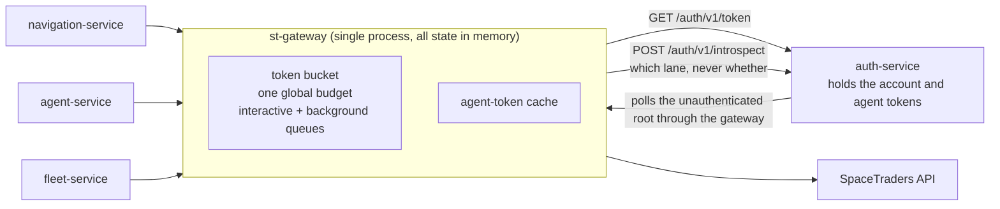
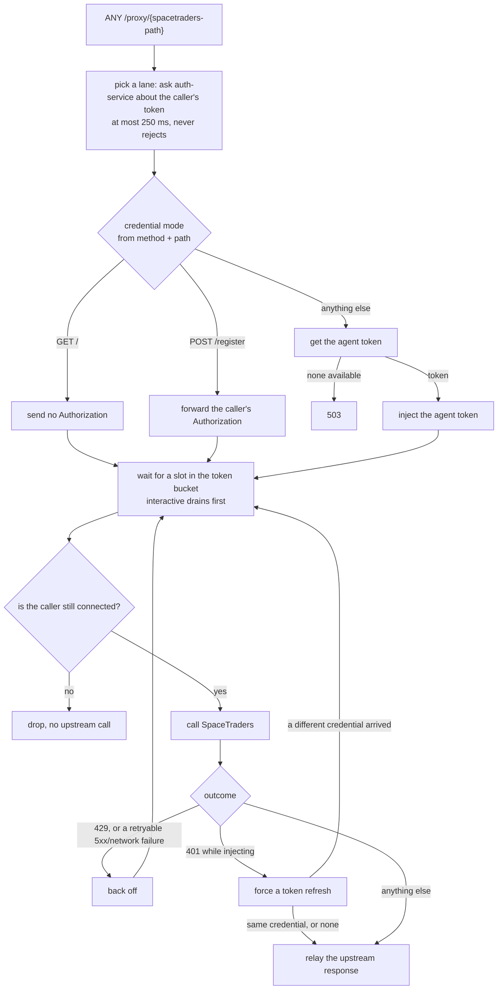
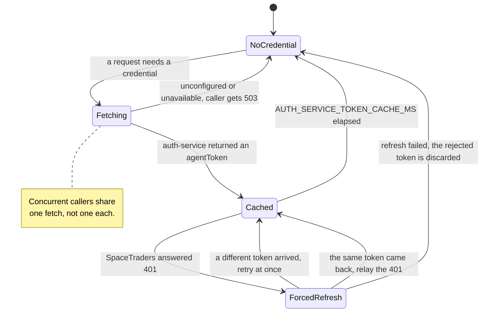

# st-gateway

**Every SpaceTraders call the whole system makes goes through this one process,
so the whole system spends one rate budget instead of several.** That is the
entire point. A second consequence follows from it: because every call passes
through here anyway, this is also the only place that needs to hold the
SpaceTraders agent token — callers no longer carry it.

Three things live here and nowhere else:

1. **One global rate budget.** A single token bucket paces every outbound call,
   FIFO, shared across all callers. Three independent clients tripping 429s
   against a per-account limit was the problem this service exists to solve
   ([meta#1](https://github.com/V-M-Pioneer-Trading/meta/issues/1)).
2. **The SpaceTraders credential.** The gateway fetches the agent token from
   auth-service, caches it, and injects it. A caller's own `Authorization` is
   ignored on game calls.
3. **Centralized retry.** 429s, 401s and — for side-effect-free methods only —
   5xx and network failures are retried here, once, centrally, instead of in
   four different client libraries with four different backoff bugs.

Everything else is a consequence of those three.

It also picks a **queue lane** for each call, from auth-service's answer about
the caller's token. That is the only thing it decides about a caller. It never
decides whether a caller may make a call — the calling service already did,
against the same auth-service — so it never rejects a request for its
credential, and an auth-service outage slows the dashboard down rather than
stopping any game call. See [Lanes](#lanes).

## Architecture

```mermaid
flowchart LR
  NAV["navigation-service"]
  AGT["agent-service"]
  FLT["fleet-service"]
  AUTH["auth-service<br/>holds the account and agent tokens"]

  subgraph GW["st-gateway (single process, all state in memory)"]
    direction TB
    BUCKET["token bucket<br/>one global budget<br/>interactive + background queues"]
    CACHE["agent-token cache"]
  end

  ST["SpaceTraders API"]

  NAV --> GW
  AGT --> GW
  FLT --> GW
  AUTH -- "polls the unauthenticated root through the gateway" --> GW
  GW -- "GET /auth/v1/token" --> AUTH
  GW -- "POST /auth/v1/introspect<br/>which lane, never whether" --> AUTH
  GW --> ST
```

There is no database and no disk. The rate budget and the token cache are
process-local, which is why this service is single-instance by construction —
see [Known limitations](#known-limitations).

## What one proxied request does

```mermaid
flowchart TD
  A["ANY /proxy/{spacetraders-path}"] --> B["pick a lane: ask auth-service about the caller's token<br/>at most 250 ms, never rejects"]
  B --> C{"credential mode<br/>from method + path"}
  C -- "GET /" --> D["send no Authorization"]
  C -- "POST /register" --> E["forward the caller's Authorization"]
  C -- "anything else" --> F["get the agent token"]
  F -- "none available" --> G["503"]
  F -- "token" --> H["inject the agent token"]
  D --> Q
  E --> Q
  H --> Q["wait for a slot in the token bucket<br/>interactive drains first"]
  Q --> R{"is the caller still connected?"}
  R -- "no" --> S["drop, no upstream call"]
  R -- "yes" --> T["call SpaceTraders"]
  T --> U{"outcome"}
  U -- "429, or a retryable 5xx/network failure" --> V["back off"]
  U -- "401 while injecting" --> W["force a token refresh"]
  W -- "a different credential arrived" --> Q
  W -- "same credential, or none" --> X["relay the upstream response"]
  U -- "anything else" --> X
  V --> Q
```

### Credential policy

Matched on **method and path** — a query string does not change the decision.

| Method + path | What is sent upstream | Why |
|---|---|---|
| `GET /` | nothing | SpaceTraders' root needs no credential, and *not* injecting is what lets auth-service poll it through this gateway without the gateway having to ask auth-service for a token in order to make the call that refreshes that token. |
| `POST /register` | the caller's own `Authorization`, verbatim | Registration authenticates with the **account** token, which only auth-service holds. Injecting here would send the wrong token, and — since an UNCONFIGURED auth-service has no agent token at all — would 503 the one call that has to work in order to ever leave UNCONFIGURED. |
| everything else | `Bearer <agent token>`, injected | The gateway owns the credential. If it cannot get one, the call gets a 503 rather than a guaranteed-failing upstream attempt. |

### Retry policy

A 429 means SpaceTraders did **not** execute the request, so replaying it is
free. A 5xx or a dropped connection may mean it *did* execute, so a POST that
might already have bought something is never replayed.

| Upstream outcome | `GET` / `HEAD` / `OPTIONS` | Every other method |
|---|---|---|
| `429` | retry with backoff | retry with backoff |
| `401`, while injecting | force a refresh; retry at once **only if a different credential comes back** | same |
| `401`, on `GET /` or `POST /register` | relayed as-is | relayed as-is |
| `500` `502` `503` `504` | retry with backoff | relayed as-is |
| network failure | retry with backoff | `502` |
| anything else | relayed as-is | relayed as-is |

Backoff is `min(max(RETRY_BASE_MS × 2^attempt, Retry-After), MAX_RETRY_DELAY_MS)`.
A 401 retry is deliberately immediate: a stale credential needs a new token,
not a delay. Retries re-enter the rate-limiter queue like any other call, so
retrying never bypasses the budget.

### The agent-token cache

```mermaid
stateDiagram-v2
    [*] --> NoCredential
    NoCredential --> Fetching : a request needs a credential
    Fetching --> Cached : auth-service returned an agentToken
    Fetching --> NoCredential : unconfigured or unavailable, caller gets 503
    Cached --> NoCredential : AUTH_SERVICE_TOKEN_CACHE_MS elapsed
    Cached --> ForcedRefresh : SpaceTraders answered 401
    ForcedRefresh --> Cached : a different token arrived, retry at once
    ForcedRefresh --> Cached : the same token came back, relay the 401
    ForcedRefresh --> NoCredential : refresh failed, the rejected token is discarded

    note right of Fetching
      Concurrent callers share
      one fetch, not one each.
    end note
```

`NoCredential` covers both "never fetched" and "held but past its TTL": in
either case the next request that needs a credential refetches. The
`ForcedRefresh --> NoCredential` edge matters — before it existed, a refresh
that failed left the credential SpaceTraders had *just* rejected in the cache,
to be re-injected on every request until the TTL ran out.

### Lanes

The token bucket drains two queues, `interactive` first. Which one a call
waits in is **derived, never declared** (auth-design.md decision 2):
`X-Priority` is not read at all, so no caller can promote itself.

Since meta#80 step 9 the gateway does not verify tokens itself. It asks
auth-service, the one component that does (decision 21), through the shared
[clerk client](https://github.com/V-M-Pioneer-Trading/clerk-client)'s
lane deriver:

| The caller's `Authorization` | Center called | Lane |
|---|---|---|
| exactly one line, `Bearer <token>`, and auth-service answers active with `kind: "operator"` | once | `interactive` |
| … answered active with `kind: "machine"` (automation-service's M2M token) | once | `background` |
| … answered `{"active": false}` (expired, foreign-signed, revoked) | once | `background` |
| … and auth-service is down, slow past 250 ms, answers non-2xx or nonsense, or refuses our secret | once | `background` |
| none at all (auth-service's own poll, an anonymous read) | **no** | `background` |
| not `Bearer` + one token: `Basic …`, `Bearer`, `Bearer `, `Bearer abc def` | **no** | `background` |
| two or more `Authorization` lines, whatever they hold, or a line count that cannot be known (the header-count limit reached) | **no** | `background` |
| anything, on `POST /register` (it carries the SpaceTraders account token, not a session; forwarded verbatim) | **no** | `background` |

The lane follows `kind` as auth-service reports it; the gateway never looks at
`sub`, and knows nothing of Clerk's subject prefixes. The line count comes
from the raw header list: Node keeps the first of two `Authorization` lines and
drops the rest, so reading the parsed header would let a caller choose which
of two credentials picks its lane.

**What it never does.** It never rejects, never answers 401, 403 or 503 for a
caller's credential, and never fails a game call because auth-service's
introspection endpoint is unavailable: a gateway that failed closed on the
center would take the whole public read surface down with auth-service. (The
vault is separate: a call that needs the injected agent token still answers
`503` when auth-service cannot supply one — see the error table.) It never waits on the center for
more than **250 ms** — well above a healthy round trip on the same host, and a
quarter of what a client that *rejects* would allow itself, because a lane is a
guess the gateway is willing to make without an answer. It asks at most once
per inbound request, before the retry loop, and never for `/health` or
`/metrics`. The fixture's thirteen gateway cases pin all of this
(`src/__tests__/lane.conformance.test.ts`).

In practice agent, fleet and navigation-service forward the dashboard's human
session verbatim, so a person watching the dashboard is `interactive`;
automation-service's machine token and auth-service's anonymous poll are
`background`.

## Endpoints

| Method + path | Returns | Auth |
|---|---|---|
| `GET /health` | `{ "status": "ok" }` | none |
| `GET /api/st-gateway/health` | same handler; the path the shared host routes to | none |
| `GET /metrics` | `{ queues: { interactive, background }: { depth, latencyMs: { count, avg, max } } }` | none |
| `ANY /proxy/<spacetraders-path>` | the upstream response, relayed | optional; a bearer token only chooses the lane, and is never refused |

Method, query string and body are forwarded verbatim; the body is never parsed.
On the way back, the status, the body and the pacing headers (`Retry-After`,
`x-ratelimit-*`) are relayed.

## Errors the gateway generates itself

Everything not listed here is an upstream response passed through unchanged.

| Status | When | Message |
|---|---|---|
| `503` | auth-service answered `503` — its documented "no agent token yet" (UNCONFIGURED) | `SpaceTraders credential not configured` |
| `503` | auth-service could not be reached, spoke nonsense, or failed on its own side — any other non-2xx, including a `403` meaning our shared secret is wrong | `auth-service unavailable: cannot obtain a SpaceTraders credential` |
| `502` | SpaceTraders unreachable after retries | `SpaceTraders unreachable: …` |
| `502` | the upstream response failed mid-read, or the handler threw | `SpaceTraders proxy failed: …` |
| `413` | request body over 5 MB | from the body parser |

The two 503s are deliberately different: one points at the SpaceTraders
credential, the other at auth-service. They used to be the same sentence — and
only auth-service's own `503` means the credential is the problem. Anything
else it answers with is auth-service's fault, not the credential's.

## Configuration

| Env var | Default | Meaning |
|---|---|---|
| `PORT` | `3002` | Listen port. Must be a whole number ≥ 1. |
| `SPACETRADERS_BASE_URL` | `https://api.spacetraders.io/v2` | Upstream base URL |
| `RATE_LIMIT_RPS` | `2` | Global budget, requests/second (≥ 0.1) |
| `RATE_LIMIT_BURST` | `1` | Bucket capacity: requests dispatchable back-to-back (≥ 1) |
| `MAX_RETRIES` | `5` | Retries after the initial attempt. Whole number ≥ 0. |
| `RETRY_BASE_MS` | `500` | First backoff delay; doubles per retry |
| `MAX_RETRY_DELAY_MS` | `30000` | Ceiling on any single retry delay, whatever `Retry-After` demands |
| `AUTH_SERVICE_URL` | `http://localhost:8082` | Where `GET /auth/v1/token` is fetched from |
| `AUTH_SERVICE_SHARED_SECRET` | *(required)* | The vault secret, presented as `X-Auth-Service-Secret` on every agent-token fetch |
| `AUTH_SERVICE_TOKEN_CACHE_MS` | `30000` | How long a fetched token is served from cache; `0` disables caching |
| `AUTH_INTROSPECTION_URL` | *(required)* | auth-service's **full** introspection endpoint, `/auth/v1/introspect` included, POSTed to verbatim — never a base URL. Absolute `http(s)`, no query string |
| `AUTH_INTROSPECTION_SECRET` | *(required)* | Presented as `X-Introspection-Secret` when asking which lane a token earns |

Every numeric value is validated at startup, and the three required
auth-service values have no defaults. A service that starts with a mangled
budget, an unparseable port, or no way to reach auth-service is a service that
looks healthy while doing the wrong thing — without the introspection
variables it would proxy every call in the background lane forever, and
nothing would say why the dashboard had gone slow — so all of those fail
loudly instead.

**The two auth-service secrets are different secrets, and must never hold the
same value.** `AUTH_INTROSPECTION_SECRET` is held by every service that asks
auth-service about a token, because an answer only describes a token the caller
already has. `AUTH_SERVICE_SHARED_SECRET` is held by st-gateway alone, because
it withdraws the agent token that spends the whole system's SpaceTraders
account. One value for both would let any service that can introspect also
fetch the agent token and call SpaceTraders around this gateway's rate budget.

`CLERK_JWT_KEY`, `CLERK_JWT_KEY_FILE` and `CLERK_ISSUER` are **no longer
read**, and since meta#80 step 10 (infrastructure#92) no stack and no compose
entry sets them for any service but auth-service; a stray value, garbage
included, changes nothing.

## Running it

| Command | What it does |
|---|---|
| `npm install` | install dependencies |
| `npm test` | jest + supertest against in-process fake SpaceTraders, auth-service and introspection servers |
| `npm run typecheck` | `tsc --noEmit` over `src/`, tests included |
| `npm run build` | compile to `dist/` — production sources only |
| `npm start` | run `dist/server.js` |
| `npm run dev` | build, then start |

Tests drive the proxy's HTTP boundary, with the three fake upstreams as the
only seams, plus a unit level for the token bucket. See `CLAUDE.md` for the harness
and its conventions.

## Known limitations

Deliberate, not accidental:

- **Single instance.** The budget and the token cache are in-process memory.
  Two replicas would be two independent rate budgets, which defeats the point
  of the service. Scale it up, not out.
- **Interactive can starve background.** Draining is strictly by class, with no
  fairness cap and no aging. Sustained interactive load would hold background
  traffic indefinitely. Interactive traffic is one person's dashboard, so this
  is theoretical at today's load.
- **A failing center is reported, not surfaced.** When introspection answers
  nothing usable — a rotated `AUTH_INTROSPECTION_SECRET`, a URL with a stray
  trailing slash — every operator is quietly queued as background. The gateway
  logs one `console.warn` line a minute while it lasts, naming the endpoint
  and never the token or the secret; nothing else says so.
- **A hanging auth-service costs every credentialed call up to 250 ms.** The
  lane is decided before the call queues, and the gateway waits that long for
  an answer before settling for `background`. Anonymous calls never wait.
- **A token spent on a caller that walked away is not reclaimed.** The upstream
  call is skipped, but the bucket slot is already gone.
- **`/metrics` is cumulative and unauthenticated.** Counters run for the life of
  the process and never reset, so `avg` dilutes a bad minute forever; there are
  no percentiles and no Prometheus exposition format. `/health` and `/metrics`
  are open.
- **Caller request headers other than `Content-Type` are dropped**, and only the
  pacing headers come back. This is a game-API proxy, not a general one.
- **Response bodies are relayed as text.** SpaceTraders is JSON-only; a binary
  upstream body would be mangled.
- **No circuit breaker.** A sustained SpaceTraders outage still queues and
  retries every request rather than shedding load.
- **Two log lines are the whole story.** A failed token fetch and a failed proxy
  request are logged; there is no request ID, no structured logging, no tracing.
- **The 5 MB body limit is hardcoded.**
